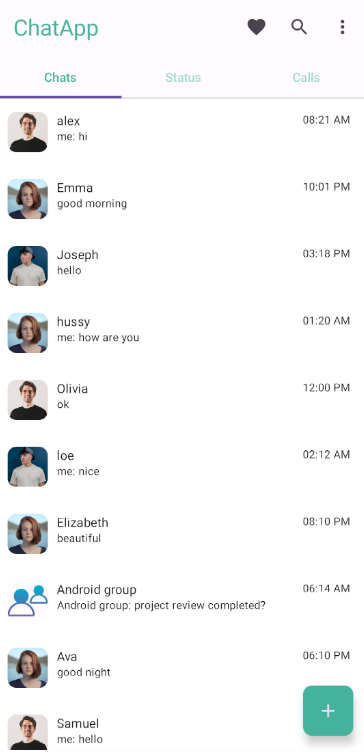
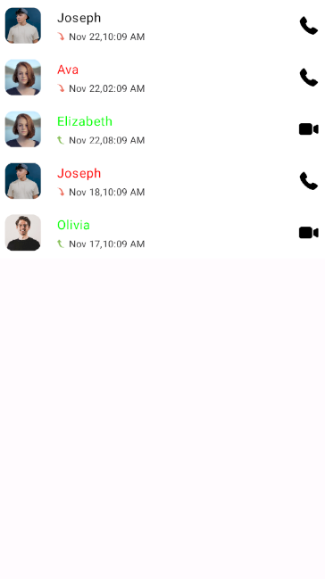
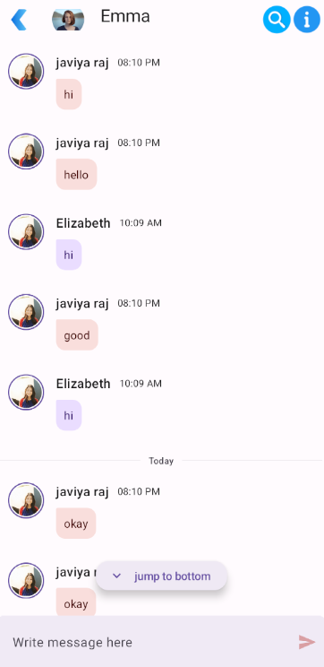
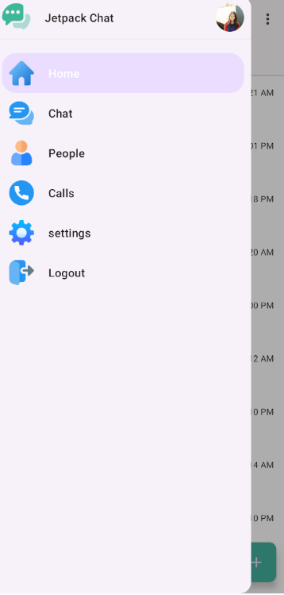
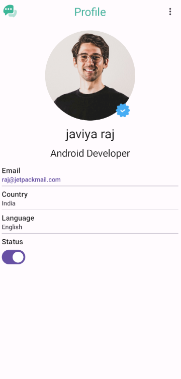

# Jetpack Chat App
Jetpack chat app (only design)
## Author

- [@javiyaraj](https://github.com/JAVIYARAJ)

## Documentation

- [Jetpack Compose](https://developer.android.com/jetpack/compose/documentation)

- [Shimmer effect](https://github.com/valentinilk/compose-shimmer)

- [Material 3](https://developer.android.com/jetpack/androidx/releases/compose-material3)

## Features

- user chat listing
- chat listing
- user status listing
- user call listing
- user profile

## Tech Stack

**Programing language:** kotlin

**Framework:** Jetpack compose

**Library:** material3, constraint layout, navigation, shimmer effect

## Screenshots

   

  

 

